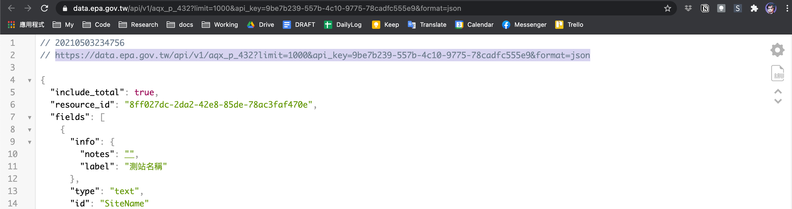

# Notes

如果你用了`View()`會沒辦法knit成html檔，導致於你無法繳交。

# Loading libraries

```{r}
library(tidyverse)
options(stringsAsFactors = F)

# loading httr package to get back web data
library(httr)

# loading jsonlite package to parse a textual json file to an R object
library(jsonlite)
```

# Typical Readings

## JSON as a string

```{r}
library(jsonlite)
fromJSON('{"a":1, "b":2}')
fromJSON('[{"a":1, "b":2}, {"a":1, "b":3}]')
fromJSON('[{"a":1, "b":2}, {"a":1, "b":3}, {"a":5, "b":7}]')
```

## JSON as a local file

```{r}
library(jsonlite)
raw <- read_json("../../R4CSS/data/url_104.json")
raw$data$list
```

## JSON as a web file

```{r}
raw <- GET("https://tcgbusfs.blob.core.windows.net/blobyoubike/YouBikeTP.json") %>%
    content("text") %>%
    fromJSON()
raw
```

# Case 1: Well-formatted Air-Quality

Go to <https://data.gov.tw/dataset/40448>, click the json file, and copy
the link, e.g.,
"<https://data.epa.gov.tw/api/v1/aqx_p_432?limit=1000&api_key=9be7b239-557b-4c10-9775-78cadfc555e9&format=json>".
(However, the link address, especially the
`pi_key=9be7b239-557b-4c10-9775-78cadfc555e9` will change every time).



```{r Getting AQI data}

url <- "YOUR URL HERE"

df <- fromJSON(content(GET(url), "text", encoding = "utf-8"))
df %>% glimpse()
df$records %>% head() %>% knitr::kable(format = "html")
```

### Using knitr::kable() for better printing

```{r using kableExtra to print}
df$records %>% head() %>% knitr::kable(format = "html")
```

## Step-by-step: Parse JSON format string to R objs

`fromJSON(content(GET(url), "text", encoding = "utf-8"))`由內到外有三個函式。
\* `httr::GET()`按照指定的url發出GET
request把網頁抓回來，如果是個合乎規定存取，就會順利取回該伺服器發的response。
\* `hrrt::content(response, "text", encoding = "utf-8")`
用`?content`查詢看看`content(response, "text")`的用途。其是把抓回來的檔案，轉為純文字的字串。content()是把抓回來的response解成純文字（JSON本身就是以純文字儲存，只是格式特別而已）。

-   `jsonlite::fromJSON()`
    因為我們用眼睛看就知道他是個JSON格式的檔案，所以用`fromJSON()`這個函式，把用JSON格式編成的字串轉為R的物件，有可能是`data.frame`或`list`。`fromJSON()`預期會把JSON中`[]`的每一個項目轉為一筆筆的資料，然後把`{}`的pair當成column的變數名稱

### `Step 1. GET()` 發送請求

向該URL的伺服器發送`GET()`
request以取得該檔案。若成功取得，他會回覆一個[HTML status
code](https://developer.mozilla.org/zh-TW/docs/Web/HTTP/Status)（你可上網查詢看看有哪些Status
code）。如果成功的話就是2開頭的數字例如`200 OK`代表該伺服器接受該請求並開始傳回檔案。

```{r}
# Getting url back by GET()


# Inspecting returned data
response
class(response)
```

(Tips) Using `?httr::GET` to inspect the function

### `Step 2. httr::content()` 將回應資料的轉純文字

回應的資料看他的`class`是一個`response`，但如果看Global
Environment看來是個`list`，裡面裝載很多資料，而主要核心的內容在`content`這個欄位，但看來是用`binary code`裝起來的，而不是純文字。

因此，對於這個抓回來的檔案，我需要用httr::content()幫忙把純文字給解出來。經查詢`help`可得知`content()`後面的參數有三類，其中可以要轉為純文字的就是`content(response, "text")`。因此偵測轉出來的變數會是長度為1的`character`。

```{r}
# Parsing to textual data by content()


nchar(text)
cat(text)
class(text)
length(text)
```

(Tips) using `??httr::content` to inspect the function

### Step 3. `fromJSON()`: 將JSON格式文字轉為R物件

最後是將這個`character`轉為R的物件，也就是data.frame或list。注意，此時text是一個`character`，那是我們知道他是用JSON格式編寫的文字檔，就像我們知道.csv檔是用逗號分隔表示法依樣，JSON就是用層層疊疊的`[]{}`記號來表述資料的結構。

並要提醒初學者，`.json`或`.csv`都只是幫助程式初步篩選檔案的副檔名罷了，這兩種類型的檔案跟`.txt`檔一樣，都被歸屬為Win系統所謂的「純文字文件檔案」（就打開以後看得到文字的意思）。裡面的究竟是不是個完整的json檔這都要去看、去測。我自然也可以在`.json`的檔案裡偷偷亂用逗號分隔模式撰寫。

```{r}


dim(df)
glimpse(df)
?fromJSON
```

## Combining all functions

UVI Open data: <https://data.gov.tw/dataset/6076>

<https://data.epa.gov.tw/api/v1/uv_s_01?limit=1000&api_key=9be7b239-557b-4c10-9775-78cadfc555e9&format=json>

```{r}
url <- "YOUR URL HERE"

# Combining all functions


df$records %>% knitr::kable()
```

# **Practices: Loading json data**

下列這些網路文件應該都是json檔，請在以下的練習中，一個一個把他帶入把他抓回來看看。並用`str()`或`dplyr::glimpse()`觀察資料的內容。注意，如果你用了`View()`會沒辦法knit成html檔，導致於你無法繳交。

```{r}
url_sc_flu <- "https://od.cdc.gov.tw/eic/Weekly_Age_County_Gender_487a.json"
url_appledaily <- "https://tw.appledaily.com/pf/api/v3/content/fetch/search-query?query=%7B%22searchTerm%22%3A%22%25E6%259F%25AF%25E6%2596%2587%25E5%2593%25B2%22%2C%22start%22%3A20%7D&d=209&_website=tw-appledaily"
url_dcard <- "https://www.dcard.tw/_api/forums/girl/posts?popular=true"
url_pchome <- "http://ecshweb.pchome.com.tw/search/v3.3/all/results?q=X100F&page=1&sort=rnk/dc"
url_ubike <- "https://tcgbusfs.blob.core.windows.net/blobyoubike/YouBikeTP.json"
url_cnyes <- "https://news.cnyes.com/api/v3/news/category/headline?startAt=1588262400&endAt=1589212799&limit=30"
```

```{r}
df <- fromJSON(content(GET(url_appledaily), "text", encoding = "utf-8"))
df$content
```

# Case 2: cnyes news

第二類是最常會見到的例子，解出來的資料是個很多階層的`list`，通常一筆資料傳回來時多會附加一些metadata，比方說，一共幾筆資料、下一個資料區塊在哪裡，好讓使用者或者本地端的瀏覽器能夠繼續取得下一筆資料。因此，資料通常會在樹狀節點的某一個子節點。

```{r}

url_cnyes <- "https://news.cnyes.com/api/v3/news/category/headline?startAt=1588262400&endAt=1589212799&limit=30"

res <- fromJSON(content(GET(url_cnyes), "text", encoding = "utf-8"))

# Using glimpse(), View(), str(), class() to preview data
# View(res)
glimpse(res)
```

    # Tracing the data.frame in the data
    res$data$list

    # Assigning to a variable
    df <- res$data$list

    # Previewing data
    head(df)
    str(df)

## (option) 取回資料並寫在硬碟

有時候寫爬蟲尤其是在爬會即時更新的資料時，會需要反覆定時地抓資料，這時候通常會先通通抓回來再慢慢合併整理。此時要特別注意如何保持每次抓回來的資料都是獨特的一個資料。以下面的例子來講，因為每次檔名都是一樣的，他會一直覆蓋過去，所以再怎麼抓，都不會是歷時性資料。通常會自動讀取當下時間當成檔名的一部分，這樣就不會重複了。這將在日後youbike的例子中用到。

    response <- GET(url_cnyes,
                    write_disk("data/url_cnyes.json",
                               overwrite=TRUE))

# Case 3: footRumor - ill-formatted

食品闢謠的例子可能是個沒好好編過JSON的單位所編出來的案子，資料很簡單，但卻是一個list裡面有329個data.frame，且每個data.frame只有對腳現有資料，然後每一筆資料就一個data.frame。

```{r}
# non-typical json, not a [] containing {} pairs

url <- 'http://data.fda.gov.tw/cacheData/159_3.json'
safefood <- fromJSON(content(GET(url),'text'))
# str(safefood)
class(safefood)
class(safefood[[1]])
dim(safefood[[1]])
# View(safefood[[1]])
# View(safefood)
# print(content(GET(url), "text"))
```

## 處理非典型的JSON檔

-   但這時候也不難觀察到其規律性。既然每個data.frame是一筆資料，且資料都是照順序出現在對角線，那我就把data.frame給`unlist()`拆成vector後，把`NA`給移除了，那剩下的就是我們要的資料了。

-   但，由於對整筆資料`unlist()`，那整筆資料會變成一個很長的vector，不過我們知道每五個元素就是一筆資料。所以我可以嘗試用`matrix()`的指令，讓資料每五個就折成一筆資料。

-   程序大致上是

    1.  `safefood.v <- unlist(safefood)` 把資料`unlist()`。
    2.  `safefood.v <- safefood.v[!is.na(safefood.v)]`剔除NA值
    3.  `safefood.m <- matrix(safefood.v, byrow = T, ncol = 5)`照列來折，因為每五個就一筆資料，所以是照列折，然後用`ncol = 5`來指定五個一折。

```{r}

# unlist data structure to a list
safefood.v <- unlist(safefood)
head(safefood.v)

# anyNA() to check if NAs still exist
anyNA(safefood.v)

# (option) check if NAs exist
sum(is.na(safefood.v))

# remove NAs
safefood.v <- safefood.v[!is.na(safefood.v)]
# length(safefood.v)

# double-check NAs
anyNA(safefood.v)
head(safefood.v)


# convert vector to matrix
safefood.m <- matrix(safefood.v, byrow = T, ncol = 5)
# ?matrix

# convert matrix to dataframe
safefood.df <- as.data.frame(safefood.m)

# delete the 4th column
safefood.df <- safefood.df[-4]

# naming the data.frame
names(safefood.df) <- c('category', 'question', 'answer', 'timestamp')

```

# Review

## Type I: Well-formatted JSON: UVI, AQI, Hospital_revisits

這類的資料以典型的[{}, {}, {}]形式儲存，以以下方式就可直接轉為data.frame
`df <- fromJSON(content(GET(url), "text"))`

## Type II: hierarchical JSON: rent591, facebook graph api, google map

這類的json資料為well-formatted，但要的資料儲存在比較深的階層中，代表其並非簡單地二維表格，還有其他更多的詮釋資料被擺在同一個JSON檔案中。解決策略：通常`fromJSON()`轉完後為list，逐一就variable
names查看資料在哪裡。`View(res$data$data)`

## Type III: Ill-formatted JSON: food_rumors, ubike

這類的資料並非以典型的`[{}, {}, {}]`形式儲存，但仍是有序的二維數據。可將資料`unlist()`攤開，然後去除不必要的NA後，按欄位數目重建Matrix再轉回data.frame

解決策略：用`as.data.frame()`或`unlist()`硬轉成data.frame或vector來看資料的出現是否有所規律。
