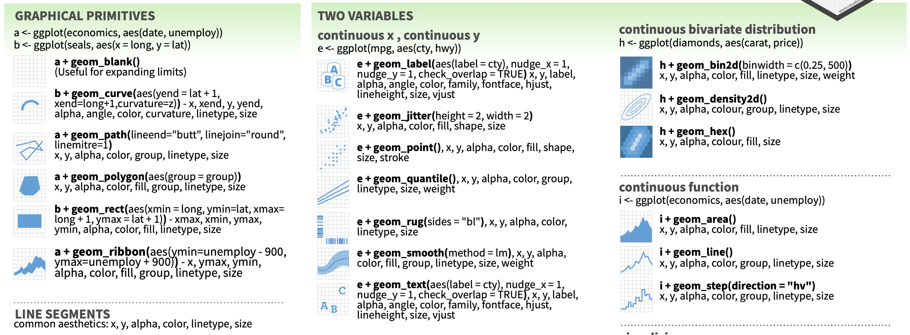

# 用ggplot視覺化(I)

本節著重在介紹`ggplot`的基本概念與設定。不同類型的圖表則在下一節「ggplot圖表類型(II)」

```{r setup, include=FALSE}
knitr::opts_chunk$set(echo = TRUE) 
# knitr::opts_chunk$set(echo = TRUE, fig.asp = 0.4, fig.width=8)
library(tidyverse)
options(scipen = 999)
```

可在一開始便透過`knitr::opts_chunk$set(echo = TRUE, fig.width = 2, fig.asp = 0.4)`來一次設定所有圖片。`fig.width = 8`與`fig.height = 6` 是以英吋（inches）為單位，或用`fig.dim = c(8, 6)`一次設定長寬[^1]。`echo = TRUE`是設定knit出輸出格式（如html）時，也要包含程式碼。如果`echo = FALSE`的話，就只會輸出文字和圖形。

[^1]: 參考資料：[5.4 Control the size of plots/images \| R Markdown Cookbook (bookdown.org)](https://bookdown.org/yihui/rmarkdown-cookbook/figure-size.html)

# Basic: Line chart

ggplot是以變數為基礎的視覺化套件，也就是說，當準備好dataframe後，就可以在ggplot中指定要用哪些變數來繪圖。也因此，務必把dataframe整理為tidy型態，也就是長表格（long-form）的型態。整理完資料後，我會習慣地用`names(plot)`或`glimpse(plot)`來看一下該資料所有的變項，好可以在下一階段的繪圖做參考。

```{r preparing-data}
NW <- read_csv("data/nytdata/interactive_bulletin_charts_agecl_median.csv") %>%
    select(Category, year, Net_Worth)  %>%
    group_by(Category) %>%
    arrange(year) %>%
    ungroup()

NW %>% glimpse()
```

## Essential elements of a plot

用ggplot來繪製圖形有三個基本函式`ggplot()` + `aes()` + `geom_圖表類型`。

1.  **指定要進行繪圖`ggplot()`**：用`%>%`將資料（dataframe）pipe給`ggplot()`後，底下各增添的繪圖選項都用`+`的符號，類似不斷修正繪圖結果的意思。
2.  **指定X／Y軸與群組因子`aes()`**：指定圖表的X/Y軸分別是什麼變數，有些圖表只需要單一個變數（例如Density-chart和Histogram），有些需要X/Y兩個變數（例如Scatter-chart）什麼的變數要做視覺化，Boxplot甚至可以直接指定最大、最小、Q1、Q3和Median等多個變數。
3.  **指定要繪製的圖表類型**。例如Line-chart為`geom_line()`、Scatter-chart為`geom_point()`、Bar-chart為`geom_col()`或`geom_bar()`。查閱[ggplot cheat sheet](https://www.maths.usyd.edu.au/u/UG/SM/STAT3022/r/current/Misc/data-visualization-2.1.pdf)可以快速翻閱有哪些圖表類型。

[](https://www.maths.usyd.edu.au/u/UG/SM/STAT3022/r/current/Misc/data-visualization-2.1.pdf)

在以下`geom_line()`的圖表中呈現鋸齒狀的折線，看似有問題，但其實是合理的。因為`year`是一個離散變數，而我們希望每個年齡層一條線的話，那就要照年齡層來分組。也因此，每一年都有有每個年齡層的資料，當我們把「年」作為X軸時，自然同一年就會有數筆不同年齡層的資料，因此才會是鋸齒狀的。

**不同的圖表類型是可以疊加在同一張圖上的**。我們也可以把`geom_point()` 另一種圖表型態加入，也是可以的，兩者的X與Y不相衝突。`geom_line()`、`geom_point()`、`geom_text()`三者會經常伴隨出現。

```{r select-vars-and-plot-type}
NW %>%    
    ggplot() + aes(year, Net_Worth) + 
    geom_line() + 
    geom_point()
```

## Grouping

上圖是我們把多個年齡層的逐年資料畫在同一條折線上，所以會呈現鋸齒狀折現的狀況。但這些年齡層並非在同一條線上呀？因此，我們要根據`Category`這個變數來做分組。ggplot的設計是以`color`或`fill`來做分組，所以我指定`color=Category`，就可以將該條折線依照變數`Category`拆分為數條線。

```{r grouping}
NW %>%    
    ggplot() + aes(year, Net_Worth, color=Category) + 
    geom_line()
```

那為什麼是用`color`來指定呢？因為`geom_line()`的色彩是在**線**，而不是在**面**上。如果是用`geom_area()`來視覺化的話，因為顏色填的是**面**，所以要用`fill=Category`如以下的範例。甚至可以同時指定`color=Category, fill=Category`。但折線圖如果要用`geom_area()`來視覺化的話，最好要上顏色的不要超過二個，不然就會像底下這個例子一樣，即使設定`alpha=0.2`的半透明，仍然會看不懂哪些顏色疊在一起。

```{r grouping-2}
NW %>%    
    ggplot() + aes(year, Net_Worth, color=Category, fill=Category) + 
    geom_area(position="dodge", alpha=0.2)
```

# 圖表調整

## 點線型態調整

下面的例子同時用了`geom_line()`和`geom_point()`，且分別設定了線寬（`size=1`）、點的大小(`size=2`)，折線型態（`linetype="dashed"`）、半透明程度（`alpha`）。

[ggplot2 line types : How to change line types of a graph in R software? - Easy Guides - Wiki - STHDA](http://www.sthda.com/english/wiki/ggplot2-line-types-how-to-change-line-types-of-a-graph-in-r-software)

```{r linetype-thickness-alpha}
NW %>%    
    ggplot() + aes(year, Net_Worth, color=Category) + 
    geom_line(size=1, linetype = "dashed", alpha=0.5) + 
    geom_point(size=2, color="dimgrey", alpha=0.5)
```

## 調整圖表主題色調

ggplot也有其圖表主題色調。之前範例的灰色圖表背景就是預設的主題，ggplot中還有好幾個預設圖表主題可以選，例如`theme_minimal()`或`theme_tw()`等等。

-   [Modify components of a theme --- theme • ggplot2 (tidyverse.org)](https://ggplot2.tidyverse.org/reference/theme.html)
-   [bbplot/bbc_style.R at master · bbc/bbplot (github.com)](https://github.com/bbc/bbplot/blob/master/R/bbc_style.R)

```{r}
NW %>%    
    ggplot() + aes(year, Net_Worth, color=Category) + 
    geom_line() + 
    theme_minimal()
```

## 調整標題、X/Y軸標籤與圖說 Titles, labels, and legend

**設定標題與X／Y軸標題（法一）**：以下設定了圖表的圖表標題、和X軸與Y軸的軸標題（`xlab`與`ylab`）。

```{r Add-x/y-label-title.M1}
NW %>%    
    ggplot() + aes(year, Net_Worth, color=Category) + 
    geom_line() + 
    theme_minimal() + 
    xlab("Year") + 
    ylab("Net Worth") + 
    ggtitle("Net Worth by year grouped by age groups")
```

**設定標題與X／Y軸標題（法二）**：這是一次設定圖表標題（`title`）、次標題（`suttitle`）、X軸與Y軸標題的方法。

```{r Add-x/y-label-title.M2}
NW %>%    
    ggplot() + aes(year, Net_Worth, color=Category) + 
    geom_line() +  
    theme_minimal() + 
    labs(title = "Net Worth by year grouped by age groups",
         subtitle = "Source from: ...",
         x = "Year",
         y = "Net Worth")
```

**調整X軸與Y軸標題位置的**：必須要透過`theme()`來設定`axis.title.x = element_text(hjust=1)`。

```{r Adjust-label-position}
NW %>%    
    ggplot() + aes(year, Net_Worth, color=Category) + 
    geom_line() + 
    theme_minimal() + 
    labs(title = "Net Worth by year grouped by age groups",
         x = "Year",
         y = "Net Worth") + 
    theme(axis.title.x = element_text(hjust=1),
          axis.title.y = element_text(hjust=1))
```

**去除X／Y軸標題（不佳）**：直接將空字串Assign給`title`、`x`、與`y`即可。

```{r Hide-X/Y-label.Bad}
NW %>%    
    ggplot() + aes(year, Net_Worth, color=Category) + 
    geom_line() + 
    theme_minimal() + 
    labs(title = "", x = "", y = "")
```

**去除X／Y軸標題（較佳）**：透過設定`theme()`來調整。可發現透過這種設定方法，原本標題和X／Y軸標題的邊界空間就會被釋放出來。

```{r Hide-X/Y-label.Better}
# No extra space for xlab, ylab and title
NW %>%    
    ggplot() + aes(year, Net_Worth, color=Category) + 
    geom_line(show.legend = F) + 
    theme_minimal() + 
    theme(plot.title = element_blank(),
          axis.title.x = element_blank(),
          axis.title.y = element_blank())
```

## 調整字型

調整字型會建議都從`theme()`來做調整，所有圖面上看得到的字都有相對應的變數可以調整字型。例如以下的例子中，把標題的字型大小調整為14粗體、X與Y軸的字型則調整了向右對齊、10粗斜體、顏色為dimgrey。

```{r}
NW %>%    
    ggplot() + aes(year, Net_Worth, color=Category) + 
    geom_line() + 
    theme_minimal() + 
    labs(title = "Net Worth by year grouped by age groups",
         x = "Year",
         y = "Net Worth") + 
    theme(plot.title = element_text(size=14, face="bold"),
          axis.title.x = element_text(hjust=1, size=10,
                                      color="dimgrey", 
                                      face="bold.italic"),
          axis.title.y = element_text(hjust=1, size=10,
                                      color="dimgrey", 
                                      face="bold.italic")
          )
```

## Setup consistent theme

如果希望所有的圖表都有一致的顏色和排版的調性，可以在一開始編輯Rmd的時候就設計好一套`theme()`並指給一個變數（例如以下的`th`）。

```{r}
th <- theme(plot.title = element_text(size=14, face="bold"),
          axis.title.x = element_text(hjust=1, size=10,
                                      color="dimgrey", 
                                      face="bold.italic"),
          axis.title.y = element_text(hjust=1, size=10,
                                      color="dimgrey", 
                                      face="bold.italic")
          )

NW %>%    
    ggplot() + aes(year, Net_Worth, color=Category) + 
    geom_line(linetype = "dashed", alpha=0.5) + 
    geom_point(size=2, color="dimgrey", alpha=0.5) + 
    theme_minimal() + 
    labs(title = "Net Worth by year grouped by age groups",
         x = "Year",
         y = "Net Worth") + th
```

### Show Chinese Font

Python和R這些程式語言的預設視覺化套件都沒辦法顯示中文，所以如果要顯示中文的話，就要指定圖表標題、X、Y軸標籤、圖說和各個部件的字型。因為我在Mac上繪圖，所以我將字型指定為**Heiti TC Light**。如果想知道自己的電腦上有什麼可以用，可以到電腦的字體簿上查找中文字體名稱，或者上網google「ggplot 中文字型選擇」。


```{r}
county <- read_csv("data/twdata/tw_population_opendata110N010.csv") %>%
    slice(-1, -(370:375)) %>%
    type_convert() %>%
    mutate(county = str_sub(site_id, 1, 3)) %>%
    group_by(county) %>%
    summarize(
        area = sum(area), 
        people_total = sum(people_total)
    ) %>%
    ungroup()
```
下面這是一個長條圖的範例（barplot，不是histogram）。Barplot可以直接指定X軸為縣市（county）和Y軸為總人口數（people_total），但是要用`geom_col()`而非`geom_bar()`。除此之外，Bar的顏色有「面」的特徵，所以若要自訂整條bar的顏色，要用`fill`而非`color`，`color`只會是每條Bar的外框。

```{r barplot}
county %>%
    arrange(desc(people_total)) %>%
    ggplot() + aes(county, people_total) %>%
    geom_col(fill="lightgrey", color="black") +
    theme_minimal()
```

舉例來說，中文字型可以是標楷體（BiauKai）、宋體（Songti TC）、黑體（Heiti TC Light）、蘋方（PingFang TC）、Noto（Noto Sans CJK TC）

```{r}
th <- 
  theme(title = element_text(family="Heiti TC Light"),
        text = element_text(family="Heiti TC Light"), 
        axis.text.y = element_text(family="PingFang TC"),
        axis.text.x = element_text(family="Heiti TC Light"),
        legend.text = element_text(family="Heiti TC Light"),
        plot.title = element_text(family="Heiti TC Light")
        )
county %>%
  ggplot() + aes(county, people_total) %>%
  geom_col(fill="skyblue") +
  theme_minimal() + th + 
  theme(axis.text.x = element_text(angle = 45))
```

## 調整圖表方向

```{r coord_flip()}
county %>%
  ggplot() + aes(county, people_total) %>%
  geom_col(fill="skyblue") +
  coord_flip() + 
  theme_minimal() + th + 
  theme(axis.text.x = element_text(angle = 45))
```

通常`coord_flip()`後往往會希望這些bar會是由上而下排序好的，但用`arrange(desc(people_total)`是無法解決問題的，因為Y軸原本會是照Y軸的刻度排列，而不是Y軸的數值。所以，要被排序的應該是Y軸的「文字」也就是那些縣市。因此，我們需要將該縣市轉為factor（1~n），並且讓這些縣市被安排的factor數值照`people_total`排列，因此要用`mutate(county = reorder(county, people_total))`。`reorder()`是一個將文字轉factor的函式，但在此特別指定照`people_total`的編排。

```{r coord_flip-with-reorder}
county %>%
  # arrange(desc(people_total) %>%
  mutate(county = reorder(county, people_total)) %>%
  ggplot() + aes(county, people_total) %>%
  geom_col(fill="skyblue") +
  coord_flip() + 
  theme_minimal() + th
```

# 突顯敘事重點

「說故事」才是整則資料新聞的核心，在運用圖表來輔助敘事時，應搭配說理說服的內容來突顯（highlight）圖面上的特徵，而不是留待讀者自己觀察。以下有三種highlight圖表部分資料的方法。第一個方法是在繪圖時用`+ scale_color_manual()`或`+ scale_fill_manual()`指定顏色給不同群組；方法二是用於原本的資料並沒有可以作為color或fill的因子，所以自行創建一個要突顯的群組。；方法三是利用gghighlight這個套件。當然方法三是最方便的，但缺點是不能指定highlight時所用的顏色。方法一的缺點是不能用條件式的判斷方法上色，如果預先不知道要highlight的群組是誰，而只可以用條件式去判斷的話，那就不能用方法一，只能用方法二和三。這三種方法各有利弊與使用時機。

## 方法一：繪圖時指定顏色給不同群組 Scale_color/fill_manual()

```{r}
NW %>% 
    ggplot() + aes(year, Net_Worth, color = Category) + 
    geom_line() + 
    scale_color_manual(
        limits=c("65-74", "35-44"),   # original chart group
        values=c("gold", "skyblue"),  # map to color
        name="Age group",             # legend title
        breaks=c("65-74", "35-44"),   # original legend group labels
        labels=c("elder(65-74)","younger(35-44)"), # map to new labels
        na.value = "lightgrey"
        ) +
    theme_minimal()
```

## 方法二：整理資料時自行群組化資料 Grouped by condition

這個方法是在原本的資料並沒有可以作為color或fill的因子，所以自行創建一個要突顯的群組。

```{r income-by-town}
county %>%
  mutate(group = if_else(county %in% c("新竹縣", "新竹市"), "highlight", "other")) %>%
  mutate(county = reorder(county, people_total)) %>%
  ggplot() + aes(county, people_total, fill=group) %>%
  geom_col() +
  scale_fill_manual(values=c("highlight"="Khaki", "other"="lightgrey")) +
  guides(fill="none") + 
  coord_flip() + 
  theme_minimal() + th
```

## 方法三：使用gghighlight套件

```{r message=FALSE, warning=FALSE}
library(gghighlight)
NW %>%    
    ggplot() + aes(year, Net_Worth, color = Category) + 
    geom_line() + 
    gghighlight(Category %in% c("65-74", "35-44")) + 
    theme_minimal() + 
    scale_x_continuous(breaks = NULL) + 
    theme(panel.background = element_rect(fill = "whitesmoke",
                                colour = "whitesmoke",
                                size = 0.5, linetype = "solid"))
```
