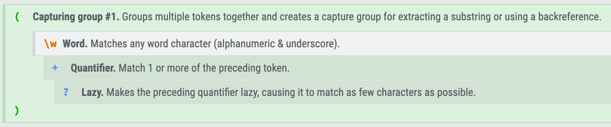

# Source

-   Author: The case is written by David Robinson, author of the book "R for text mining", author of library tidytext, data scientist at StackOverFlow.
-   Link of github: <https://github.com/dgrtwo/dgrtwo.github.com/blob/master/_R/2016-08-09-trump-tweets.Rmd>
-   Link of the article: <http://varianceexplained.org/r/trump-tweets/>
-   Slide: [R05_2 Text data maniputation trump_tweets](https://docs.google.com/presentation/d/1XObGWzjldqcXuPQ8o4GyUkHAPSaujuBUyjhE5aYI8vQ/edit?usp=sharing)

# Load and clean data

```{r}
library(tidyverse)
# options(stringsAsFactors = F) # default opotion in R > 4.0
options(scipen = 999)
```

# Loading data

```{r}
load(url("http://varianceexplained.org/files/trump_tweets_df.rda"))
dim(trump_tweets_df)
names(trump_tweets_df)
# save(trump_tweets_df, file="data/trump_tweets_df.rda")
```

# Cleaning data

## Extract source/user-agent

```         
    source  n
    <chr>   <int>
1   Android 762     
2   iPhone  628 
```



[RegExr: Learn, Build, & Test RegEx](https://regexr.com/)

-   `<a href=\"http://twitter.com/download/android\" rel=\"nofollow\">Twitter for Android</a>`
-   `<a href=\"http://twitter.com/download/iphone\" rel=\"nofollow\">Twitter for iPhone</a>`
-   `Twitter for (\\w+?)<、`

```{r}
html <- '<a href="http://twitter.com/download/android" rel="nofollow">Twitter for Android</a>'

# 取出文字內容 using str_match()
text <- str_match(html, "<a[^>]*>Twitter for (.*?)<\\/a>")[2]
text
```

```{r}
trump_tweets_df$statusSource[1]
trump_tweets_df$statusSource[2]
trump_tweets_df$statusSource[3]

## Extract source/user-agent

tweets <- trump_tweets_df %>%
    select(id, created, text, statusSource) %>%
    # mutate(source = str_match(statusSource, '<a[^>]*>Twitter for (.*?)<\\/a>')[,2]) %>% View
    extract(statusSource, "source", "Twitter for (\\w+?)<") %>%
    filter(source %in% c("iPhone", "Android"))

tweets %>% count(source)

tweets %>%
    ggplot() + 
    aes(created) + 
    geom_density()


tweets %>%
    ggplot() + aes(created, color=source) + 
    geom_density()

```

::: practice
**Practice.** 嘗試問ChatGPT，如何用R抽取「`<a href=\"http://twitter.com/download/iphone\" rel=\"nofollow\">Twitter for iPhone</a>`」這個HTML碼的文字部分（也就是Twitter for iPhone）。並且限定他使用R、stringr、運用tidyverse style撰寫看看。

**Practice.** 當它輸出一個Regular Expression時，嘗試問他該Regular Expression的意涵為何。
:::

# Vis: Hour by tweet percentage

-   Converting timezone
-   Plotting number of tweets by hour

```{r}
library(lubridate)

# tweets %>%
#     mutate(hour = hour(with_tz(created, "EST"))) %>%
#     count(source, hour) %>%
#     ggplot() + 
#     aes(hour, n, color = source) +
#     geom_line()


tweets %>%
    mutate(hour = hour(with_tz(created, "EST"))) %>%
    count(source, hour) %>%
    group_by(source) %>%
    mutate(percent = n / sum(n)) %>%
    ungroup() %>% 
    ggplot() + aes(hour, percent, color = source) + 
    scale_color_manual(labels = c("Adroid", "iPhone"),
                       values = c("royalblue", "gold")) +
    geom_line(linewidth = 1) + 
    labs(x = "Hour of day (EST)") + 
    theme_minimal()

```

# With Pictures or Not

1.  Filtering out tweets starting with "
2.  Mutating new variable `picture` to indicate whether text has picture or not?
3.  Counting `source` by `picture`
4.  Plotting bar chart to compare difference between sources.

```{r}
library(stringr)
tweets %>%
    # YOUR CODE SHOUD BE HERE
    # 1.Filtering out tweets starting with "
    
    # 2. Mutating new var picture/or not? picture
    
    # 3. Counting source by picture
    
    # 4. Plotting bar chart to compare difference between sources. 
    ggplot() + 
    aes(source, n, fill = picture)  +
    geom_col(position = "dodge") + 
    scale_fill_manual(labels = c("No pictrue/link", "Picture/link"),
                      values = c("gold", "royalblue"))


```

# Comparison of words

1.  Removing all urls by replacement
2.  Un-nesting sentence to words in tidy-form by `unnest_token()`
3.  Filtering out stop_words by `anti_join()`
4.  Counting word frequency for plotting

```{r}
library(tidytext)	# unnest_tokens()
library(stringr)	# str_detect(), str_replace_all()
tidytext::stop_words
# View(test)


tweets %>%
    filter(!str_detect(text, '^"')) %>%
    ## 1. removing urls
    mutate(text = str_remove_all(text, "https?://\\S+")) %>%
    mutate(text = str_to_lower(text)) %>%
    ## 2. unnesting word tokens
    mutate(word = str_extract_all(text, "\\b\\w+\\b")) %>%
    unnest(word) %>%
    filter(!word %in% tidytext::stop_words$word) %>%
    
    ## 3. filter out stopwords
    
    ## 4. Counting word frequency
    count(word, sort = T) %>%
    slice(1:30) %>%
    mutate(word = reorder(word, n)) %>%
    ggplot() + aes(word, n) + 
    geom_col() + 
    coord_flip()

# stop_words$word

tweet_words <- tweets %>%
    filter(!str_detect(text, '^"')) %>%
    mutate(text = str_replace_all(text, "https://t.co/[A-Za-z\\d]+|&amp;", "")) %>%
    # unnest_tokens(word, text) %>%
    unnest_tokens(word, text, token = "regex", pattern = "[^A-Za-z\\d#@']") %>%
    filter(!word %in% stop_words$word,
           str_detect(word, "[a-z]"))
```

# Visualization

```{r}

tweet_words %>%
    anti_join(stop_words) %>%
    count(word, sort = T) %>%
    slice(1:30) %>%
    mutate(word = reorder(word, n)) %>%
    ggplot() + aes(word, n) + 
    geom_col() + 
    coord_flip()    

```

# Word-level analysis

-   Comparing word frequency

```{r}
tweet_words %>% 
    count(word, source) %>%
    pivot_wider(names_from = source, 
            values_from = n, 
            values_fill = 0) %>%
    mutate(iPhone = (iPhone+1) / (sum(iPhone)+1),
           Android = (Android+1) / (sum(Android)+1)) %>%
    mutate(diff = log2(Android / iPhone)) %>%
    group_by(diff > 0) %>%
    top_n(20, abs(diff)) %>%
    ungroup() %>%
    mutate(word = reorder(word, diff)) %>%
    ggplot() + aes(word, diff, fill = diff > 0) + 
    geom_col() + 
    coord_flip() + 
    scale_fill_manual(name = "", labels = c("iPhone", "Android"), 
                      values = c("royalblue", "gold"))
```

# words frequency by different devices

```{r}

word_by_source <- tweet_words %>%
    count(word, source) %>%
    filter(n >= 5) %>%
    pivot_wider(names_from = source, 
            values_from = n, 
            values_fill = 0) %>%
    ungroup()

sum(word_by_source$iPhone)
sum(word_by_source$Android)
```

## Calculating log-ratio

```{r}
android_iphone_ratios <- word_by_source %>%
    
    
    
    
```

## visualizing ratio

```{r}


android_iphone_ratios %>%
    group_by(logratio > 0) %>%
    top_n(10, abs(logratio)) %>%
    ungroup() %>%
    mutate(word = reorder(word, logratio)) %>%
    ggplot(aes(word, logratio, fill = logratio < 0)) +
    geom_col() +
    coord_flip() +
    ylab("Android / iPhone log ratio") +
    scale_fill_manual(name = "", 
                      labels = c("Android", "iPhone"),
                      values = c("royalblue", "gold"))
```
