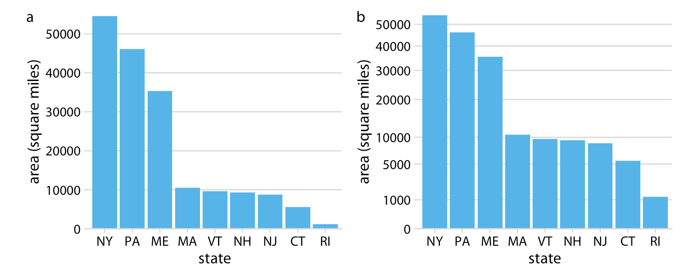
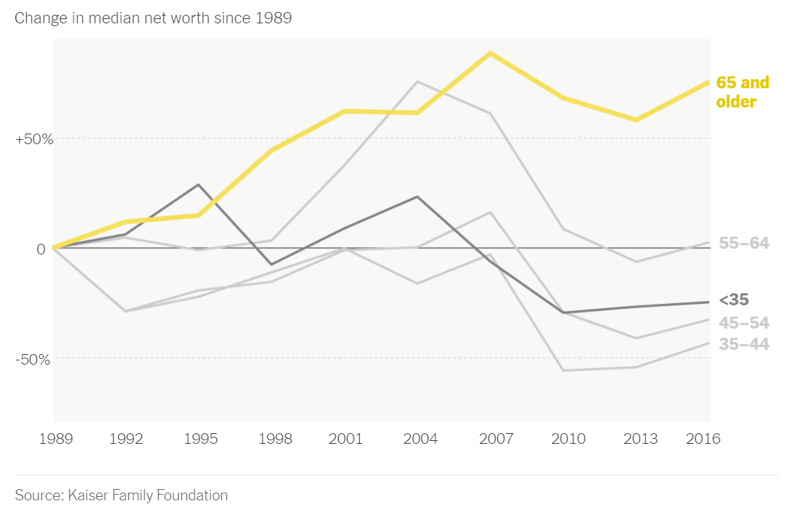

```{r include=FALSE}
knitr::opts_chunk$set(cache = T, warning = F, message = F, 
                      class.output = "output", out.width='100%', 
                      fig.asp = 0.5, fig.align = 'center')
library(tidyverse)
```

# Coordinate

本章節談論的是視覺化圖表的座標軸，本章節所涵蓋的概念可參考*Claus O. Wilke*所著之[Fundamentals of Data Visualization](https://clauswilke.com/dataviz/coordinate-systems-axes.html)的Chap3 Coordination & Axis與Chapter 8 [Visualizing distributions: Empirical cumulative distribution functions and q-q plots](https://clauswilke.com/dataviz/ecdf-qq.html)。

## NYT: Population Growth {#population_growth}

紐時這篇報導「[When Did the Anthropocene Start? Scientists Closer to Saying When. - The New York Times (nytimes.com)](https://www.nytimes.com/2022/12/17/climate/anthropocene-age-geology.html)」討論了人類活動對地球所產生的深遠影響，並探討人類是否已經進入了一個新的地質時期，被稱為「人新世」。報導指出，人類的經濟活動、能源消耗和人口增長是人新世的主要因素，並且這些因素已經在地球上留下了不可磨滅的痕跡。報導也提到，地質學家已經發現了人新世的證據，包括核爆炸中的鈽同位素、肥料中的氮和發電廠的灰燼等。然而，報導也問道，人新世是否真的已經開始，以及它的開始點是否應該是農業革命、工業革命、核彈（77年前）或其他發展。


### Parsing table from pdf

至[R4CSS/data](https://github.com/p4css/R4CSS/tree/master/data)可以下載到本範例所用的資料（是一個pdf檔案）<https://github.com/p4css/R4CSS/raw/master/data/world_population_change.pdf>。

我們可使用`tabulizer`這個套件來萃取PDF文件中的表格，官方雖然提供cran可以直接安裝，但有可能會遇到R的版本不符要求而安裝不起來的情形。此時可用第二種方法，直接從github上安裝該套件。

程式碼使用 **`extract_tables()`** 函數從指定的PDF文件中提取表格數據，並將其存儲在 **`tables`** 變量中。在這個函數中，我們指定了要從第1頁中提取表格數據。

```{r eval=FALSE}

# Method 1
# install.packages("tabulizer")

# Method 2
# if (!require("remotes")) {
#     install.packages("remotes")
# }
# remotes::install_github(c("ropensci/tabulizerjars", "ropensci/tabulizer"))

library(tidyverse)
library(tabulizer)
# Extract the table

tables <- extract_tables('data/world_population_change.pdf', pages = 1)

# Extract the first element of the variable
raw <- as.data.frame(tables[[1]])

population_by_year <- raw %>%
   select(1, 2) %>%
   slice(-c(1:4)) %>%
   rename(years_to_2020 = V1, population = V2)
   # select(years_to_2020 = v1, population = v2)
   # mutate(years_to_2020 = v1, population = v2)
```

### X and Y with log-scale

通常情況下，當數據範圍很大，且存在極端值或者偏離值時，使用對數轉換可以更好地展示數據的分佈情況。在這種情況下，你可以使用 **`scale_x_log10()`** 或 **`scale_y_log10()`** 函數將 x 軸或 y 軸轉換為對數刻度。

例如，如果你有一個數據集，其中一個變量的數值範圍從1到100000，且大多數數據會集中在較小的值上，那麼使用線性刻度將導致數據在圖形中的分佈不平衡，而較大的值會集中在圖形的邊緣或者消失在圖形之外。在這種情況下，使用對數刻度可以更好地展示數據的分佈情況，並且可以更好地顯示較大值之間的差異。而上述資料便有這樣的特色，尤其是在Y軸方向，一開始人口增加量不多，後來指數成長，此時若使用線性尺度，會看不清楚一開始的人口增加量。

```{r}
library(cowplot)

load("data/world_population_change.rda")

population_by_year

toplot <- population_by_year %>%
   mutate(years_to_2020 = map(years_to_2020, ~(str_remove(., ",")))) %>%
   mutate(years_to_2020 = as.numeric(years_to_2020),
           population = as.numeric(population))

toplot %>% head

p1 <- toplot %>%
    ggplot() + 
    aes(x=years_to_2020, y=population) + 
    geom_point() + 
    theme_bw()


p2 <- toplot %>%
    ggplot() + 
    aes(x=years_to_2020, y=population) + 
    geom_point() + 
    scale_x_log10() + scale_y_log10() + 
    scale_x_reverse() + 
    theme_bw()

cowplot::plot_grid(
  p1, NULL, p2,
  labels = c("(a) Original Scale", "", "(b) Low-Scale"),
  nrow = 1, rel_widths = c(1, 0.1, 1)
)
```

## Order as axis {#vilpopulation}

學術論文若要呈現一群數據的分佈時，最常用的是密度（分佈）函數、累積分佈函數，最常視覺化的方法是密度分佈圖（`geom_density()`）或直方圖（`geom_histogram()`)。然而，**對新聞等強調「說故事」的文體而言，說故事的技巧往往不是「那一群資源多或資源少的對象」，而經常要直指「那個對象」，要能夠看得見所敘述的對象在圖中的位置。**此時，用密度分佈來呈現的話，只能看出，該對象在分佈的某個位置；但可以改用將資料對象根據某個數據來排序後，繪製折現圖的方式來表現。例如，若要繪製一個班級的成績分佈，通常X軸是分數（組），Y軸是獲得該分數（組）的人數；但其實可以將個體依照分數來做排序，Y軸不是某個分數（組）的個數，而是每個排序後的個體，而且以排序後的序號（Ranking）來表示。用折線圖繪製後，一樣可以看出分數的分佈，但卻能夠直接標記敘事中的某個對象是Y軸中得哪個點。


-   See [What's Going On in This Graph? \| Vaccination by Country](https://www.nytimes.com/2022/01/06/learning/whats-going-on-in-this-graph-jan-12-2022.html) from[What Data Shows About Vaccine Supply and Demand in the Most Vulnerable Places - The New York Times (nytimes.com)](https://www.nytimes.com/interactive/2021/12/09/world/vaccine-inequity-supply.html)

    The original chart is animated along the timeline.[What Data Shows About Vaccine Supply and Demand in the Most Vulnerable Places - The New York Times (nytimes.com)](https://www.nytimes.com/interactive/2021/12/09/world/vaccine-inequity-supply.html)


```{r message=FALSE, warning=FALSE, include=FALSE}
library(tidyverse)
options(scipen = 999)
th <- theme_minimal() + 
  theme(title = element_text(family="Heiti TC Light"),
        text = element_text(family="Heiti TC Light"), 
        axis.text.y = element_text(family="Heiti TC Light"),
        axis.text.x = element_text(family="Heiti TC Light"),
        legend.text = element_text(family="Heiti TC Light"),
        plot.title = element_text(family="Heiti TC Light")
        )
```

## Log-scale

以下我打算繪製出每個村里在15歲以上的人口數，來呈現台灣有些村里人口相當稀少，尤其是花蓮縣、澎湖縣、南投縣和宜蘭縣的幾個聚落。並標記出幾個人口數最高的里。如果我的目的是呈現村里人口數的統計分佈，我會用`geom_density()`來繪圖（如下），但實際上沒辦法從這樣的密度函式圖來說故事，指出那些人口數過高或過低的村里。

```{r}
raw <- read_csv("data/opendata107Y020.csv", show_col_types = FALSE)  %>% 
    slice(-1) %>% 
    type_convert()

raw %>%
  ggplot() + aes(edu_age_15up_total) + 
  geom_density()
```

因此，一個比較好的策略是，把各村里的人口數由小到大或由大到小排序好，編好Rank比序的代號，然後讓X軸做為比序，逐一在Y軸打出每一個村里的數據。

但這邊值得注意的是，如果沒有放大尾端（也就是村里人口數最少的那部分），實際上也很難繪圖。所以對Y軸取log，就可以看清楚Y軸的資料點。

```{r Fig3-5-6-log-scale-village-level-population, message=FALSE}

toplot <- raw %>%
    select(site_id, village, edu_age_15up_total) %>%
    arrange(desc(edu_age_15up_total)) %>%
    mutate(index = row_number()) %>%
    mutate(label = ifelse(index <= 5 | index > n()-5, paste0(site_id, village), ""))

library(ggrepel)

p2 <- toplot %>% ggplot() + aes(index, edu_age_15up_total) + 
    geom_point(alpha=0.5, color="royalblue") + 
    geom_text_repel(aes(label = label), point.padding = .4, color = "black",
                  min.segment.length = 0, family = "Heiti TC Light") + 
    theme(axis.text.x=element_blank()) + 
    scale_y_log10(breaks = c(0, 1, 10, 100, 1000, 10000)) + 
    theme_minimal()

p1 <- toplot %>% ggplot() + aes(index, edu_age_15up_total) + 
    geom_point(alpha=0.5, color="royalblue") + 
    theme(axis.text.x=element_blank()) + 
    theme_minimal()

cowplot::plot_grid(
  p2, NULL, p1,
  labels = c("a", "", "b"), nrow = 1, rel_widths = c(1, 0.1, 1)
)
```

```{r}
library(tidyverse)
library(gghighlight)
```

## 

## Square-root scale

Chap3 Coordination & Axis [Fundamentals of Data Visualization (clauswilke.com)](https://clauswilke.com/dataviz/coordinate-systems-axes.html)



前面是視覺化了各村里大於十五歲以上人口的人口數分佈，採用對數尺度（log-scale）可以觀察到比較小的村里。那有什麼是適合用平方根尺度（sqrt-scale）的呢？是土地嗎？密度嗎？還是人口數？是村里等級嗎？鄉鎮市區等級嗎？還是縣市等級？

```{r Fig03-8-TW-Population-Density, fig.cap = '(ref:population-area)'}

town <- read_csv("data/tw_population_opendata110N010.csv") %>%
    slice(-1, -(370:375)) %>%
    type_convert()

town %>%
    arrange(desc(area)) %>%
    mutate(index = row_number()) %>%
    ggplot() + aes(index, area) %>%
    geom_col(fill="skyblue") +
    scale_y_sqrt() + 
    theme_minimal()

county <- town %>%
    mutate(county = str_sub(site_id, 1, 3)) %>%
    group_by(county) %>%
    summarize(
        area = sum(area), 
        people_total = sum(people_total)
    ) %>%
    ungroup()

p1 <- county %>%
    arrange(desc(people_total)) %>%
    mutate(index = row_number()) %>%
    ggplot() + aes(index, people_total) %>%
    geom_col(fill="lightgrey") +
    # scale_y_sqrt() +
    theme_minimal()

p2 <- county %>%
    arrange(desc(people_total)) %>%
    mutate(index = row_number()) %>%
    ggplot() + aes(index, people_total) %>%
    geom_col(fill="khaki") +
    scale_y_sqrt(breaks=c(0, 250000, 500000, 1000000, 2000000, 4000000)) +
    theme_minimal()

cowplot::plot_grid(
  p1, p2,
  labels = c("a", "b"), 
  nrow = 1
)
```

## Increasing percentage as Y

### NYT: Net Worth by Age Group {#networth}

::: notes
**LEARNING NOTES**

Median for Inequality
:::

這個教學案例來自紐約時報的「What's going on in this gragh」系列資料視覺化教學之[Teach About Inequality With These 28 New York Times Graphs - The New York Times (nytimes.com)](https://www.nytimes.com/2021/05/11/learning/lesson-plans/teach-about-inequality-with-these-28-new-york-times-graphs.html) 。該圖表呈現在不同年代、不同年齡層的人所擁有的淨資產（包含土地、存款、投資等減去債務）。該圖表的結果指出，在不同年代的老年人是越來越有錢，但年輕人卻越來越窮（該曲線為減去1989年

[](https://www.nytimes.com/2021/05/11/learning/lesson-plans/teach-about-inequality-with-these-28-new-york-times-graphs.html)

### Read and sort data

Sorted by `arrange()` function.

```{r}
p1 <- read_csv("data/interactive_bulletin_charts_agecl_median.csv") %>%
    select(year, Category, Net_Worth) %>%
    group_by(Category) %>%
    arrange(year) %>%
    ungroup()
p1 %>% filter(year <= 1992) %>% knitr::kable()
```

```{r}
library(gghighlight)
p1 %>% ggplot() + aes(year, Net_Worth, color = Category) + 
    geom_line() + 
    geom_point() + 
    gghighlight(Category %in% c("65-74", "35-44")) + 
    theme_minimal() + 
    scale_x_continuous(breaks = NULL) + 
    theme(panel.background = element_rect(fill = "white",
                                colour = "white",
                                size = 0.5, linetype = "solid"))

```

```{r}
p2 <- read_csv("data/interactive_bulletin_charts_agecl_median.csv") %>%
    select(year, Category, NW = Net_Worth)  %>%
    group_by(Category) %>%
    arrange(year) %>%
    mutate(increase = (NW-first(NW))/first(NW)) %>%
    ungroup()
p2 %>% filter(year <= 1992) %>% knitr::kable()
```

美國35歲以下的年輕人的中位淨資產比起年長的美國人來說，一開始平均貧窮得多。從「Less than 35」這條線看來，現在的年輕世代比起2004年的年輕世代所擁有的淨資產低了40%。相比之下，65歲以上的美國人現在的淨資產，相較於2004年增加了9%。隨著時代變化，可想像會有一群人的淨資產越來越多，只是現在從這個圖表看來，年輕人所擁有的淨資產相較於過去是越來越低的，多半流入了成年人和老年人手中。

```{r}
p2 %>% ggplot() + aes(year, increase, color = Category) + 
    geom_line() + 
    geom_point() + 
    gghighlight(Category %in% c("65-74", "Less than 35")) + 
    theme_minimal() + 
    scale_y_continuous(labels=scales::parse_format()) + 
    scale_x_continuous(breaks = NULL) + 
    theme(panel.background = element_rect(fill = "white",
                                colour = "white",
                                size = 0.5, linetype = "solid"))
    
```

## X/Y aspect ratio

### UNICEF-Optimistic (WGOITH) {#optimistic}

<https://www.nytimes.com/2021/11/17/upshot/global-survey-optimism.html> <https://changingchildhood.unicef.org/about>

```{r}
plot.opt <- read_csv("data/unicef-changing-childhood-data.csv") %>% 
    select(country = WP5, age = WP22140, bw = WP22092) %>%
    mutate(country = ordered(country, 
                             levels=c(1, 3, 4, 10, 11, 12, 
                                      13, 14, 17, 29, 31, 
                                      33, 35, 36, 60, 61, 
                                      77, 79, 81, 87, 165), 
                             labels=c("USA", "Morocco", "Lebanon", 
                                      "Indonesia", "Bangladesh", 
                                      "UK", "France", "Germany",
                                      "Spain", "Japan", "India", 
                                      "Brazil", "Nigeria", "Kenya", 
                                      "Ethiopia", "Mali", "Ukraine",
                                      "Cameroon", "Zimbabwe",
                                      "Argentina", "Peru"))) %>%
    count(country, age, bw) %>%
    group_by(country, age) %>%
    mutate(perc = n/sum(n)) %>% 
    ungroup() %>%
    filter(bw == 1) %>%
    select(country, age, perc) %>%
    spread(age, perc) %>%
    rename(`15-24y` = `1`, `40+y` = `2`)

plot.opt %>% head(10) %>% knitr::kable()
```

```{r}
plot.opt %>%
    ggplot() + aes(`40+y`, `15-24y`, label = country) + 
    geom_point(color = "skyblue", size = 2) + 
    xlim(0, 1) + ylim(0,1) + 
    geom_text(hjust = -0.1, vjust = -0.5) + 
    geom_abline(intercept = 0, slop = 1, 
                color="lightgrey", alpha=0.5, linetype="dashed") + 
    theme_minimal() + 
    theme(aspect.ratio=1)

```
